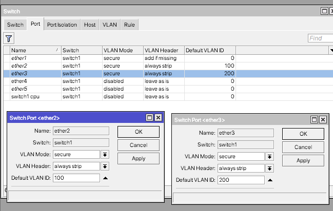

# LAB-41-Switch
Jum'at 22 Agustus 2025  
  
# VLAN
  VLAN merupakan sebuah metode yang sering digunakan untuk mendistribusikan beberapa segmen jaringan berbeda pada perangkat router dengan interface ethernet fisik yang terbatas. Dengan VLAN ini kita bisa membuat sebanyak **4095** segmen LAM dalam sebuah interface. Dalam pembuatan VLAN terdapat sebuah paramater utama yaitu Core Port (tagged) dan Edge Port (Untagged). Mungkin pada istilah lain kedua paramater tersebut lebih dikenal sebagai Trunk Port dan Access port.  
  VLAN menjadi sangat penting juga VLAN ini digunakan, yaitu ketika network dapat menjadi semakin besar skalanya dan traffic broadcast menjadi beban seluruh network. 

# Konfigurasi VLAN 
  
  1. Pastikan R Utama sudah memiliki konfigurasi dasar sampai terhubung ke internet.
  
  2. Kemudian selanjutnya adalah router utama ini akan saya gunakan untuk distribusi kebawah mengunakan 2 VLAN, caranya buat interface baru, di **interface > add > VLAN**. Tambahkan 2 buah VLAN dengan ID 100 dan 200. Dan arahkan untuk ether2.  
  
  3. Tambahkan IP untuk router karna nanti akan digunakan sebagai gateway. **IP > Address**. Agar interface vlan100 ini akan memberikan IP 172.31.1.x dan vlan200 akan memberikan 192.168.30.x.  
  
  4. Agar lebih mudah, disini kita akan membuat DHCP server untuk masing-masing VLAN interface. **IP > DHCP SERVER > DHCP SETUP**  
  

# Konfigurasi VLAN pada perangkat Routerboard yang memiliki Switch Chipset
  1. Pertama kita liat dulu ether berapa saja yang tergabung dengan switch chipset group, di **switch > Port**. Sebagai contoh, ether1-5 disini berada didalam 1 switch chip yang sama.  
  
  2. Selanjutnya kita buat Bridge di **Bridge > add**. 
  
  3. Selanjutnya tambahkan **port**, dengan pindah ke tab **port** masih di menu **Bridge**. lalu **add**. Buat untuk ether1, 2, dan 3. Dibawah ada **Hardware offload**, ketika centang maka traffic akan dialihkan melalui hardware switch chipset.  
  
  4. Selanjutnya untuk memetakan VLAN kita haeus masuk kedalam menu switch kemudian masuk ke tab VLAN lalu add. Untuk VLAN 100 Trunkingnya ada di ether1 dan access nya ada di ether2. Untuk VLAN 300 trunkingnya ada di ether1 dan access nya ada di ether3.  

  
  6. Selanjutnya pindah ke menu port, pada menu ini kita harus edit untuk vlan trunking dan vlan accessnya. Yang di edit adalah vlan mode dan vlan header. Untuk ethernet atau vlan trunking, saya akan memilih vlan mode secure. Lalu ether 2 dan 3 yang akan digunakan untuk vlan access sama vlan modenya secure, akan tetapi vlan headernya always strip, walways strip ini akan menghilangkan vlan tagging yang ada dari vlan trunking.  

  
  8. Cukup sampai sini konfigurasi VLAN, sekarang pengetesan, cukup sambungkan laptop ke etehr 2 dan 3, jika berhasil laptop akan mendapat IP sesuai IP static yang kita set tadi. Masuk ke control panel Network COnnections.  
     eth2  
  
     eth3  
  

# Pembahasan  
1. VLAN Trunking
     Jika membawa lebih dari 2 informasi VLAn maka disebut VLAN Trunking.  
3. VLAN Access
     Untuk laptop atau client yanf terkoneksi dari ether2 atau ether3 dinamakan dengan VLAN Access.  

# Kesimpulan
  Dengan VLAN ini kita bisa membuat sebanyak **4095** segmen LAM dalam sebuah interface. Dalam pembuatan VLAN terdapat sebuah paramater utama yaitu Core Port (tagged) dan Edge Port (Untagged).
